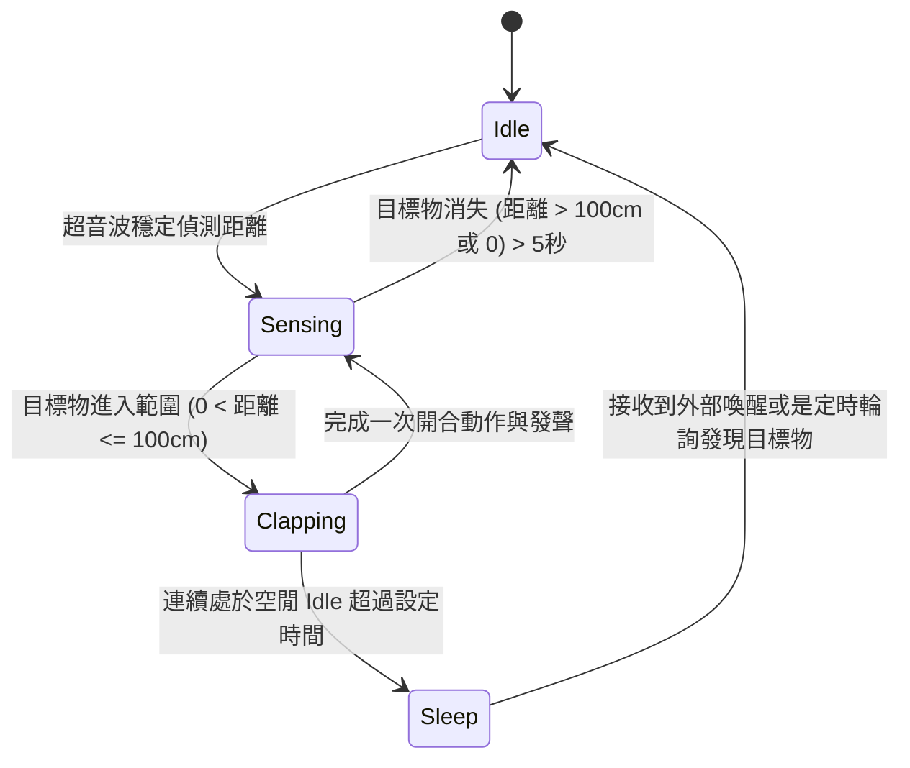

# 軟體工程文件：系統設計文件 (SD)
**專案名稱：** Arduino 拍手互動裝置 (微動開關觸發版)
**文件狀態：** 正式版本 v1.0

## 1. 系統狀態機設計 (State Machine)

設備的運行依照以下四個主要狀態 (State) 進行流轉：



- **Idle (待機)**：系統維持最小運作，馬達維持張開角度，停止播放音樂。
- **Sensing (偵測)**：持續以超音波輪詢，執行移動平均濾波 (Moving Average) 來平滑距離數值。
- **Clapping (作動)**：執行馬達角度閉合、微動開關與 Fallback 判斷、音效觸發，最後馬達歸位張開。
- **Sleep (休眠)**：深層省電模式 (若硬體支援)，或僅為邏輯上的完全靜止以防過度耗電。

## 2. 核心演算法與參數 Mapping

### 2.1 距離到延遲時間 (Delay)
依據 PRD FR-02：距離越近，拍手越快（延遲越短）。
以 100cm 對應慢速（週期約 2000ms），10cm 對應快速（週期約 500ms）為例：
- `clampDistance = constrain(currentDistance, 10, 100)`
- `clapDelayMs = map(clampDistance, 10, 100, 500, 2000)`

### 2.2 距離到音量 (Volume)
依據 PRD FR-03：距離越近，音效越大聲。DFPlayer 容許音量為 0~30。
以 100cm 對應低音量 (10)，10cm 對應極大音量 (30) 為例：
- `targetVolume = map(clampDistance, 10, 100, 30, 10)`
- 為了避免音量跳動過於生硬，可實作音量平滑調整（Volume Smoothing），每週期僅增減固定步階，而非直接賦值。

## 3. 觸發與備援 (Fallback) 邏輯設計

為確保影音同步與提供硬體損耗的容錯能力，在 `Clapping` 狀態下，軟體實作了嚴格的時間窗 (Time Window) 檢查機制。這也是本設計的核心演算法。

### 3.1 邏輯流程圖

```mermaid
graph TD
    StartClap[進入 Clapping 狀態] --> MoveServo[呼叫 servo.write(閉合角度)]
    MoveServo --> StartTimer[啟動非同步計時器 start_time = millis()]
    
    StartTimer --> CheckLoop[進入非阻塞輪詢迴圈 While]
    
    CheckLoop --> HasSwitchSignal{是否偵測到微動開關<br/>Falling Edge?}
    
    HasSwitchSignal -- 是 (主路徑) --> PlaySound[發送 UART 播放指令]
    HasSwitchSignal -- 否 --> IsTimeout{是否超時?<br/>millis() - start_time > 200ms}
    
    IsTimeout -- 未超時 --> CheckLoop
    IsTimeout -- 已超時 (Fallback) --> LogError[紀錄硬體未觸發例外]
    LogError --> PlaySound
    
    PlaySound --> DelayHold[延遲維持閉合狀態, 待音效初始播放]
    DelayHold --> MoveServoOpen[呼叫 servo.write(張開角度)]
    MoveServoOpen --> FinishClap[回歸 Sensing 狀態計算下一次循環]
```

### 3.2 虛擬碼實作參考

```cpp
void executeClapWithFallback() {
    // 1. 馬達作動閉合
    servoLeft.write(ANGLE_CLOSE);
    servoRight.write(ANGLE_CLOSE);
    
    unsigned long startTime = millis();
    bool soundPlayed = false;
    
    // 2. 監聽時間窗，例如 200ms
    while (millis() - startTime <= OVERRIDE_TIMEOUT_MS) {
        // 讀取帶有 Debounce 的開關狀態
        if (readSwitchCurrentState() == LOW && readSwitchPreviousState() == HIGH) {
            // == 觸發主路徑 == 
            playAudioSync();
            soundPlayed = true;
            break; // 跳出等待迴圈
        }
    }
    
    // 3. Fallback 檢查：若時間窗已過，且尚未播放聲音
    if (!soundPlayed) {
        // == 觸發 Fallback 備援路徑 ==
        // TODO: 可在此處控制 LED 閃爍以利維修人員辨識硬體故障
        playAudioSync();
    }
    
    // 4. 維持閉合一小段時間以表現實體感
    delay(50);
    
    // 5. 馬達復位張開
    servoLeft.write(ANGLE_OPEN);
    servoRight.write(ANGLE_OPEN);
}
```

## 4. 防彈跳 (Debounce) 設計與訊號防護

由於微動開關內部的金屬彈片在物理接觸瞬間會產生數十微秒 (μs) 的反覆彈跳高低電位，為避免 DFPlayer 接收過多播放指令而卡死（破音或連擊），採用軟體計時防彈跳：

1. **輪詢 Debounce**：設定常數 `DEBOUNCE_DELAY_MS = 50`。
2. 當偵測到狀態改變（如從 HIGH 變為 LOW 時），記錄初次捕捉的時間 `lastDebounceTime = millis()`。
3. 若下一次輪詢時間 `millis() - lastDebounceTime > DEBOUNCE_DELAY_MS` 且狀態不變，始確認為真實的實體接觸。

> [!IMPORTANT]
> 亦可在 UART 播放指令發送端加上 Rate Limiting（例如：指令間隔至少需有 200ms 以上），進一步保護 DFPlayer 模組的硬體解碼穩定性。
